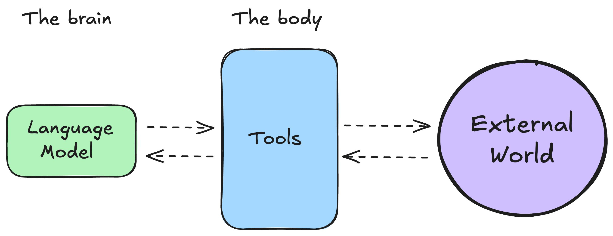

# ¿Qué es un agente de IA?

Para entender los agentes de IA, empecemos por plantearnos uno. Imagina que te dispones a viajar a Tokio por trabajo. Estás demasiado ocupado para organizarlo, pero por suerte, tu empresa está suscrita a un servicio de agente de viajes con IA que puede ayudarte en la tarea. Llamemos a este agente KITT[^1].

[^1]: Como el asistente de la serie _El coche fantástico_.

En el chat conversacional de KITT escribes lo siguiente:

> KITT, voy a viajar a Tokio el 26 de junio y me quedaré allí hasta el 12 de julio. Ayúdame a organizar mi viaje.

## Razonamiento y planificación
Como KITT entiende el __lenguaje natural__, capta rápidamente nuestra solicitud. Antes de hacer nada, KITT lleva a cabo un proceso de razonamiento y planificación, a consecuencia del cual llega a un __plan de acción__, que se compone de los pasos a seguir y las herramientas a utilizar para cumplir la petición correctamente.

En nuestro ejemplo, KITT identifica el siguiente plan de acción:

1. Acceder a tu itinerario y calendario
2. Identificar dónde deberás alojarte según tu agenda de reuniones
3. Identificar vuelos y hoteles relevantes
4. Comunicarte el plan
5. Finalmente, organizar tu viaje

## Pasar a la acción
Tras haber identificado su plan, KITT ahora necesita actuar de acuerdo al mismo. 

Para ejecutar el plan, puede usar las __herramientas__ que tiene a su disposición. De manera que accede a:

1. Tu calendario y correo electrónico para entender tu agenda y reuniones
2. La documentación relacionada con la política de viajes de tu empresa
3. Expedia o Booking.com para determinar los mejores vuelos y hoteles
4. Finalmente, comparte contigo una propuesta del plan y, una vez acordada, reserva los arreglos de viaje

## Razonamiento, planificación y acción
En definitiva, un agente de IA es:
> Un modelo de IA capaz de razonar, planificar y actuar mediante un conjunto de acciones, interactuando con su entorno.

Puedes pensar en un agente como un sistema compuesto por dos partes principales:

- El cerebro: El __modelo de IA__ que se encarga del ^^razonamiento^^ y la ^^planificación^^. Decide qué acciones tomar según la situación. Se compone de un LLM (Large Language Model o Modelo Grande de Lenguaje) preparado (entrenado) para acometer tareas agentivas.

- El cuerpo: Representa la ^^acción^^, todo lo que el agente puede hacer a través de __herramientas__.

Estos sistemas son agentivos porque tienen la capacidad de obrar, de hacer cosas, lo que significa que pueden interactuar con el mundo real utilizando sus capacidades y las herramientas a las que se les dé acceso.

He aquí otra forma de definirlo:

> Un agente es un sistema que aprovecha un modelo de IA para interactuar con su entorno y alcanzar un objetivo definido por el usuario. Combina razonamiento, planificación y ejecución de acciones (a menudo mediante herramientas externas) para cumplir tareas.

## Niveles de agencia
Por lo tanto, además de responder a cuestiones, los sistemas de IA pueden llevar a cabo tareas, lo cual los hace agentivos.

En la siguiente tabla se exponen diferenes niveles de agencia en los sistemas de IA:

|Nivel|Agencia|Descripción|Ejempos|
|--|--|--|--|
|0|Sin agencia|Sistemas que solo pueden responder a partir del conocimiento intrínseco del modelo, el adquirido durante su fase de aprendizaje o entrenamiento. O bien un software que ejecuta tareas discretas, predefinidas|Chatbots con conocimiento propio (p.e. ChatGPT), sistemas que automatizan un flujo de trabajo |
|1|Un enrutado básico|Sistemas que encauzan el flujo por una vía u otra. La agencia del modelo consiste en que _decide_ por qué camino tirar (con ajuste fino del modelo, p.e.)|En atención al cliente, identifica si un ticket debe ir a facturación o a soporte técnico|
|2|Con uso de herramientas|Pueden utilizar herramientas externas|Un agente IA de viajes como KITT|
|3|Agentes autónomos|Pueden llevar a cabo múltiples pasos de forma autónoma|Sistemas de búsqueda profunda, Deep Research, con razonamiento en múltiples pasos y uso de herramientas|
|4|Sistemas multiagente|Sistemas que pueden delegar flujos de trabajo a múltiples agentes|Asistentes de programación que pueden idear, generar, e integrar código|