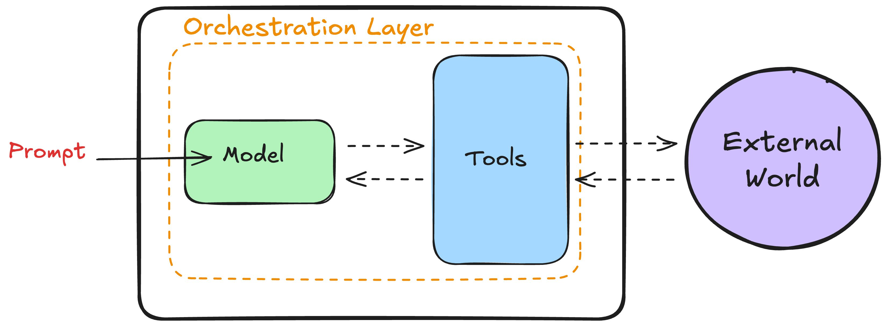
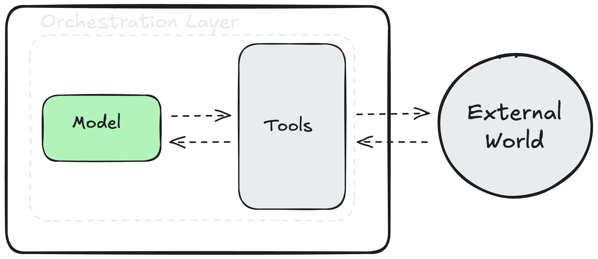
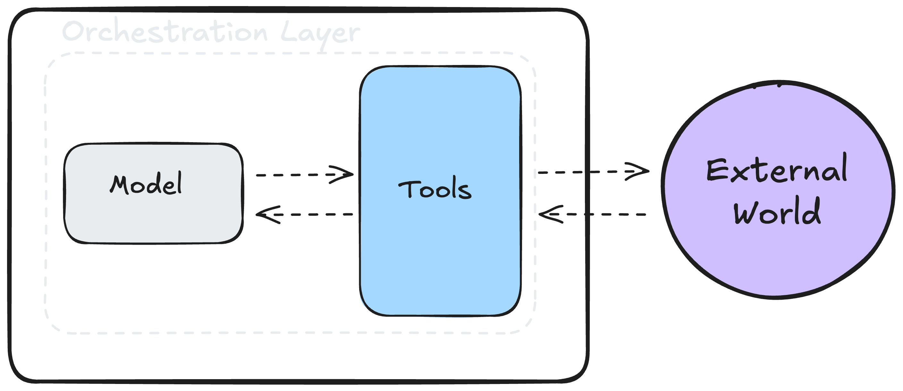
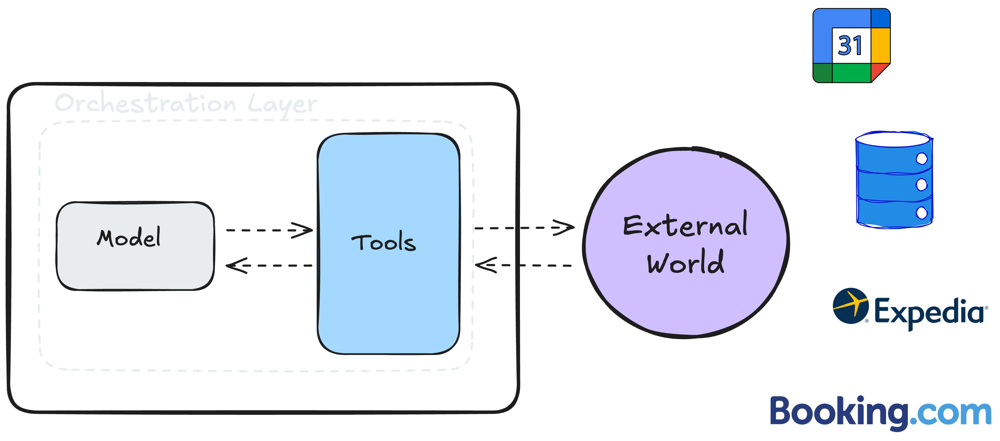
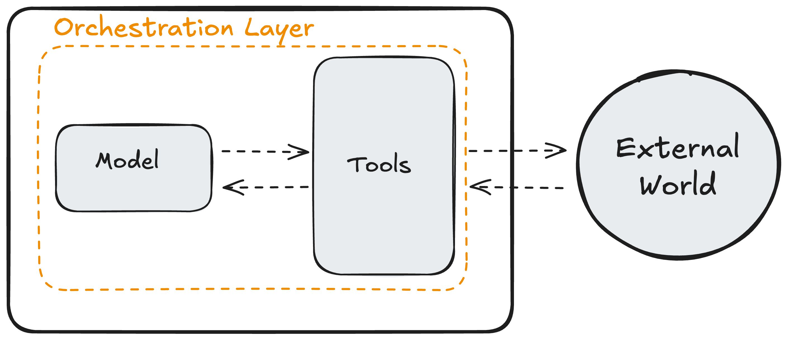
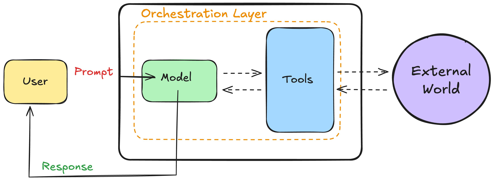

# ¿Qué hace que un agente sea agentivo?

Ya hemos visto que los agentes de IA combinan razonamiento, planificación y acción para alcanzar objetivos. Pero, ¿qué es lo que da a los agentes estas capacidades? ¿Qué hace que un agente sea _agentivo_?

Vamos a mirar dentro para descubrir los elementos esenciales de los que se componen los agentes de IA.

Para ello emplearemos a KITT, nuestro agente de viajes con IA, quien, basándose en nuestra solicitud, revisó nuestro itinerario, reservó vuelos y hoteles adecuados, y nos presentó un plan de viaje detallado. Sigamos el recorrido de lo que sucede cuando haces una petición a un sistema como KITT.

## La trinidad agentiva
Cuando escribiste tu petición para reservar un viaje, tres componentes esenciales trabajaron juntos: el __modelo__, las __herramientas__ y la capa de __orquestación__.

### Modelo
Considera el modelo como el cerebro de KITT. Es un LLM (Large Language Model: Modelo Grande de Lenguaje) que entendió tu solicitud y determinó qué pasos debía seguir.

El modelo razona sobre el problema planteado y lo descompone en pasos más pequeños. En este ejemplo, toma una solicitud de viaje y la divide en los diferentes pasos que el agente debe realizar. Sin esto, KITT no podría desarrollar las acciones necesarias para cumplir su objetivo.

> KITT, voy a viajar a Tokio el 26 de junio y me quedaré allí hasta el 12 de julio. Ayúdame a organizar mi viaje.

>
- :material-robot: "Necesito acceder a tu itinerario y a tu calendario"
- :material-robot: "Necesito acceder a tu email y a calendario para ver tu plan de reuniones"
- :material-robot: "Necesito encontrar vuelos que sean compatibles con la política de la empresa"
- :material-robot: "Necesito encontrar hoteles compatibles que estén cerca de los lugares de reunión"
- :material-robot: "Necesito comunicar los detalles del viaje de una manera digerible"

### Herramientas
Ahora bien, incluso el cerebro más inteligente necesita una manera de interactuar con el mundo. Ahí es donde entran en juego las Herramientas.

Para ayudarte a planificar tu viaje, KITT accedió a tu calendario, revisó las políticas de viajes de la empresa, y buscó en Expedia y Booking.com los mejores vuelos y hoteles. Cada uno de estos es una herramienta que accede a un servidor, bases de datos o internet. Las herramientas amplían la capacidad del modelo para obtener información actualizada, realizar acciones e interactuar con interfaces digitales. Son esenciales para conectar el modelo con el mundo real.

### Orquestación
La orquestación es un bucle continuo que controla cómo un agente procesa información, recuerda datos y toma decisiones. Piensa en ella como la encargada de gestionar el ciclo de toma de decisiones del agente: recibe datos, reflexiona sobre lo que significan y decide qué hacer a continuación. También lleva un registro de todo lo que el agente ha hecho hasta el momento. Este ciclo se repite hasta que el agente logra su objetivo o alcanza un punto de detención predefinido.

Esta capa de orquestación puede ser sencilla, como seguir reglas básicas del tipo “si-entonces”, o más sofisticada, involucrando cadenas de razonamiento complejas e incluso otros modelos de IA. Profundizaremos más en la orquestación en el próximo capítulo. Por ahora, lo que necesitas saber es que mantiene en marcha al agente hasta que se cumple el objetivo o se llega al punto de parada.

