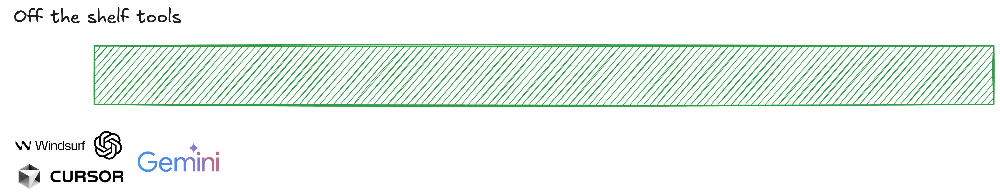
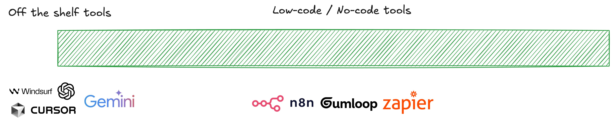
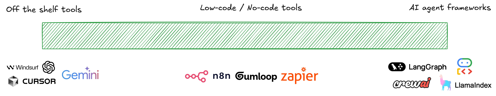
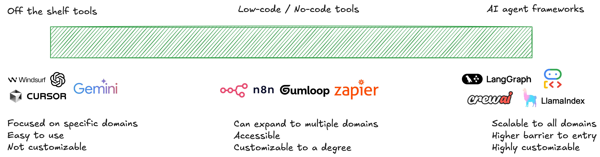

# ¿Cuándo emplear agentes?

Aunque los agentes pueden ser herramientas muy potentes, no en todos los casos son adecuados, depende de la tarea a realizar. 

¿Cuándo se deberían adoptar sistemas agentivos? ¿Cuándo no?

## El caso de dos equipos de soporte al cliente
Para poner esto en contexto, imagina dos equipos diferentes de soporte al cliente. Ambos grupos trabajan para empresas del sector del comercio minorista y quieren reforzar sus operaciones con IA.

### Equipo de soporte A

Para el equipo de soporte A, el 80% de los tickets de soporte corresponden a preguntas del tipo:
>
- :material-face-woman:: "¿Cómo rastreo mi pedido?"
- :material-face-man:: "¿Cómo devuelvo un artículo?"
- :material-face-woman:: "¿Cómo cambio mi dirección de envío?"

Es decir, el 80% de los tickets que tiene que gestionar el equipo de soporte A tienen en común las siguientes características: 

- Requieren una toma de decisiones simple
- No necesitan acceder a los datos ni al historial del cliente
- Las consultas admiten respuestas discretas y predecibles

En este contexto, el equipo de soporte A __no necesita un agente de IA__ y puede optar por un chatbot sencillo que esté preparado para responder a este tipo de preguntas una vez se le haya facilitado el conocimiento necesario. Existen dos posibilidades en este sentido:

1. Emplear la ventana de contexto del modelo para facilitarle la documentación con la información, por ejemplo utilizando la técnica __RAG__ (Retrieval Augmented Generation).
2. Reentrenar el modelo en lo que se llama un ajuste fino (__fine-tuning__) para que adquiera el conocimiento que precisa el caso.

### Equipo de soporte B

Para el equipo de soporte B, el 80% de los tickets corresponden a problemas complejos como por ejemplo:
>
- :material-face-man:: "Me cobraron dos veces, pero un pedido fue cancelado, y tengo crédito de una devolución anterior que no se aplicó correctamente."

Es decir, la mayoría de los tickets del equipo de soporte B tienen en común las siguientes características:

- Requieren una toma de decisiones compleja
- Necesitan acceder a los datos y al historial del cliente
- Las consultas piden soluciones que se adapten al caso en concreto

El equipo de soporte B sí se beneficiaría de una __solución agentiva__ que pueda acceder a los datos del cliente, generar estrategias de resolución, implementarlas y actualizar los sistemas de soporte con ellas.

## Cuándo emplear agentes de IA
En resumen, se debería contemplar la adopción de soluciones agentivas cuando:

- Los problemas que se intentan resolver requieran una toma de decisiones compleja
- Dependan en gran medida de datos no estructurados
- Tengan reglas difíciles de mantener en todos los casos
- Requieran resolución de problemas adaptativa

Por ejemplo:

- Sistemas de soporte al cliente como los que necesitaba el equipo B
- Asistentes de programación de sofware que puedan leer módulos de código
- Realizar actualizaciones e implementarlas automáticamente
- Asistentes de investigación avanzada (Deep Research) capaces de descomponer una tarea en diferentes pasos, realizar búsquedas en la web, acceder a sitios de investigación y datos públicos, y sintetizar resultados.

## Ecosistema de agentes de IA
Una vez identificada la necesidad de emplear un agente de IA, el siguiente paso es entender el ecosistema de herramientas existentes en el mercado para su implementación. El mismo es dinámico y cambia rápidamente (año 2025). En cualquier caso, pueden organizarse en los siguientes grupos:

### Herramientas "listas para usar"
Permiten aplicar un sistema agentivo a un problema específico como la programación asistida por IA o la investigación avanzada.

### Herramientas "low-code/no-code"
Permiten construir flujos de trabajo de una complejidad baja en cuanto a agentividad. Estos agentes serían la próxima generación de herramientas de automatización de flujos de trabajo que se han empleado en los últimos años.

### "Frameworks" de desarrollo de agentes
Finalmente están los frameworks (herramientas-marco) de desarrollo de agentes de IA que permiten construir sistemas agentivos complejos desde cero. Son los más utilizados por desarrolladores para crear sistemas realmente robustos.

Cada conjunto de herramientas ofrece ventajas y desventajas, incluyendo facilidad de uso y nivel de personalización.

## Desarrollar la solución o comprarla
Como sucede en general con el software, la elección entre desarrollar o comprar depende de diversos factores:

- Deberías considerar __comprar herramientas "listas para usar"__ si:
    - Estás abordando un dominio o caso de uso específico
    - Ya existe una solución madura y bien probada en el mercado
    - Quieres minimizar la carga de mantenimiento

- Deberías considerar __comprar plataformas "low-code/no-code"__ si:
    - Necesitas algo de personalización pero no control total
    - Tus flujos de trabajo son moderadamente complejos pero siguen patrones comunes
    - Quieres que los usuarios de negocio puedan modificar el agente sin ayuda de ingeniería
    - Necesitas integrarte rápidamente con sistemas existentes

- Deberías __desarrollar una solución propia con "frameworks"__ de agentes si:
    - El agente debe emplear sistemas que son propietarios
    - Estás manejando datos sensibles
    - El agente es clave para tu ventaja competitiva
    - No existe una solución en el mercado que cumpla tus requisitos especializados
    - Necesitas control total sobre el comportamiento y la evolución del agente